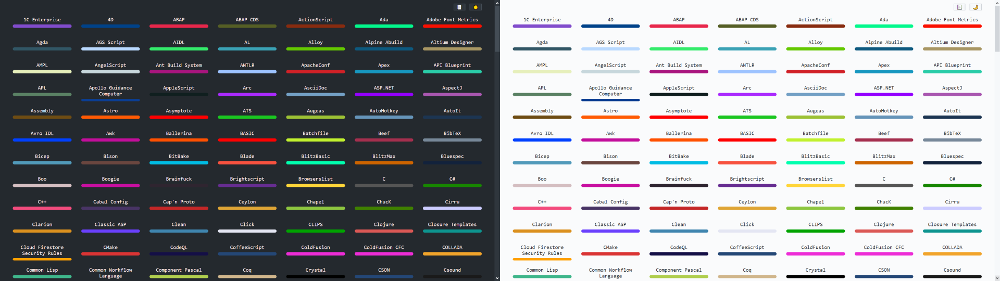

# linguist-colors

Press any key to swap color schemes.

They disabled github pages on linguist so I made my own.
See [linguist/pull/5029](https://github.com/github/linguist/pull/5029#issuecomment-759345026).
